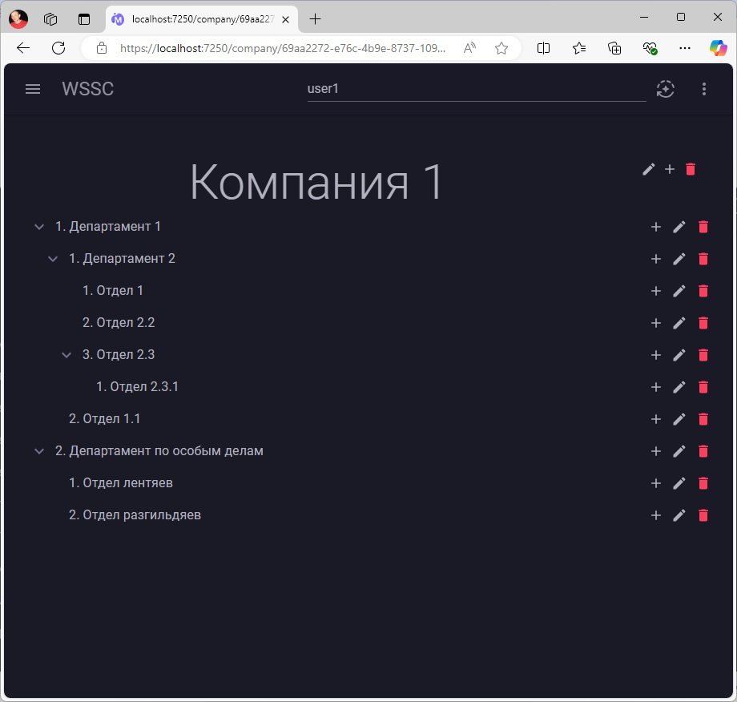

ОНО работает!!!
В принципе как и просили:
1. Представление в виде дерева
1. Возможность редактирования
1. Добавление/удаление
1. Перемещение узлов

Описание принятых решений:
1. Основной интерактив реализован на стороне клиента, связь с сервером через контролеры REST Api. Данный маневр позволяет изменить фронт, при этом оставить бакэнд не тронутым.
1. Одновременная работа пользователей. Реализовано через "извлечение" элементов (привет SharePoint), т.е. как только пользователь нажал кнопочку изменить, будет отправлен запрос на сервер о возможности этого действия. Если извлечь получилось пользователю становится доступна форма редактирования. При сохранении или отмены редактирования с объекта на стороне сервера снимается блокировка.
1. При попытке удалить элемент проверяется не только удаляемый, но и все дочерние на предмет их извлечения.
1. Передумал писать менеджер данных, и разрезал его на независимые контроллеры. Конечно с точки зрения архитектуры вроде как "не правильно", однако очень эффективно и просто в сопровождении.